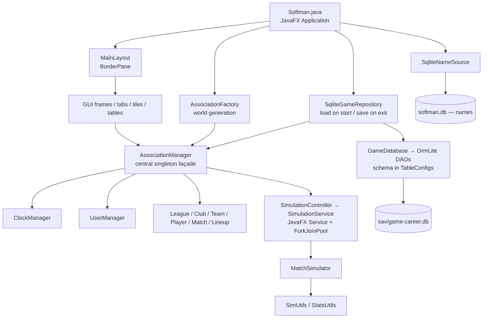

# SoftMan — Current State Summary

> Snapshot taken 2026-07-30, **refreshed 2026-08-04** against the code as it stands after the module split (`fc33b69`…`71ae445`), the JavaFX purge from core (`3197d29`) and persistent save/load (`1d8dce6`).
<!---->
> Purpose: map the existing codebase before resuming development.

## 1. Project at a Glance

| Item | Value |
| --- | --- |
| Type | Desktop game — softball club/team management simulator |
| Language / Build | Java 25, Maven multi-module (`elrh:softman:1.0-SNAPSHOT`, packaging `pom`) |
| Modules | `softman-core` (logic) · `softman-db` (persistence) · `softman-desktop` (JavaFX client) |
| UI | JavaFX 21.0.5 (programmatic, **no FXML files**) |
| Persistence | SQLite via OrmLite — snapshot save/load, not active record |
| Source files | 86 main (46 core + 9 db + 31 desktop) + 11 test = 97 `.java` files |
| Build status | ✅ `mvn clean test` → **BUILD SUCCESS**, 36 tests, 0 failures |
| Last commits | `c01d17a` / `592993b` (GUI rewrite plan), preceded by `1d8dce6` persistent save/load |
| Branch | `master` |

### Dependency stack

`commons-lang3` · `sqlite-jdbc` · `ormlite-jdbc` · JavaFX (base/controls/fxml/graphics) · Lombok · SLF4J + slf4j-simple · BootstrapFX (CSS themes) · FontAwesomeFX (icons) · Medusa (gauges) · ControlsFX (GridView) · JUnit 5 + Hamcrest.

Dependencies are declared per module: core gets only commons-lang3 / Lombok / SLF4J, `softman-db` adds sqlite-jdbc + ormlite, all JavaFX and UI libraries live in `softman-desktop`.

> ⚠️ README is up to date on Java 25, but its module table lists only two modules and still attributes persistence to `softman-core`.

---

## 2. Architecture

Three Maven modules, singleton-heavy, with a manager façade in the middle. The module boundary is now mechanically enforced: `softman-core` declares no JavaFX and no JDBC dependency, and there is not a single `import javafx` in it.

### Package map

| Module | Package | Contents |
| --- | --- | --- |
| desktop | `.` | `Softman` — JavaFX `Application` entry point, game setup/teardown |
| desktop | `gui` | `MainLayout` (BorderPane root) |
| desktop | `gui.frame` | `MenuFrame`, `FocusFrame`, `ContentFrame`, `ActionFrame` |
| desktop | `gui.tab` | `ClubTab`, `MatchTab`, `TeamTab`, `PlayerTab`, `LineupTab`, `TrainingTab`, `StandingsTab` |
| desktop | `gui.tile` | `ClubInfoTile`, `CalendarTile`, `ScheduleRowTile`, `MatchHeaderTile`, `BoxScoreTile`, `LineupTile`, `LineupRowTile`, `DefenseTile`, `PlayerInfoTile`, `PlayerAttributesTile` |
| desktop | `gui.table` | `LeagueStadingsTable`, `TeamPlayersTable` |
| desktop | `gui.sim` | `SimulationController`, `SimulationService` |
| desktop | `gui.utils` | `FormatUtils`, `GUIUtils`, `InfoUtils`, `ProgressIndicatorUtil` |
| db | `db` | `GameDatabase` (connection + DAOs), `TableConfigs` (the whole schema), `SqliteGameRepository`, `SqliteNameSource`, `LocalDatePersister`, and the persistence-only rows `GameMeta`, `TeamPlayerRow`, `LineupSpotRow`, `BoxScoreRow` |
| core | `logic` | `AssociationManager`, `MatchSimulator`, `Result` (a real `record`) |
| core | `logic.core` | `League`, `Club`, `Team`, `Player`, `Match`, `Lineup` |
| core | `logic.core.data` | `AbstractEntity` + plain data holders: `ClubInfo`, `LeagueInfo`, `TeamInfo`, `LineupInfo`, `MatchInfo`, `MatchPlayByPlay`, `PlayerInfo`, `PlayerAttributes`, `PlayerRecord`, `PlayerStats` |
| core | `logic.core.stats` | `Standing`, `BoxScore` |
| core | `logic.managers` | `ClockManager`, `UserManager` |
| core | `logic.enums` | `PlayerPosition`, `PlayerLevel`, `PlayerGender`, `MatchStatus`, `StatsType`, `ActivityType` |
| core | `logic.interfaces` | `IFocusedClubListener`, `IFocusedTeamListener`, `ISimulationRunner`, `IMatchReporter`, `IConfirmationPrompt`, `IGameRepository`, `INameSource` |
| core | `utils` | `Constants`, `ErrorUtils`, `SimUtils`, `StatsUtils`, `Utils` |
| core | `utils.factory` | `AssociationFactory`, `ClubFactory`, `TeamFactory`, `PlayerFactory` |

### Cross-cutting patterns

- **Singletons everywhere** — every manager, frame and tab exposes `getInstance()`. Convenient but makes testing awkward (see `AssociationManager.testMode` flag hack).
- **`Result` record** — `(boolean ok, String message)` returned from most mutating operations instead of exceptions; `ErrorUtils.handleException()` converts throwables into it.
- **Domain / data split** — rich domain objects (`Player`, `Team`, …) wrap plain Lombok data holders in `logic.core.data` that extend `AbstractEntity`. `AbstractEntity` now carries only `getId()` + `equals`/`hashCode`; the old `persist()` active-record hook is gone.
- **Ports & adapters at the edges** — core talks to `IGameRepository` and `INameSource`; `softman-db` supplies `SqliteGameRepository` / `SqliteNameSource`, wired in `Softman.setupGame()`.
- **Schema lives outside the domain** — OrmLite `DatabaseTableConfig`s are built by hand in `softman-db/TableConfigs`, so no persistence annotations leak into core.
- **UUID identity** — every entity is keyed by `UUID`; managers hold `LinkedHashMap<UUID, …>` to keep insertion order stable.
- **Observer** — `UserManager` broadcasts focused-club/focused-team changes to registered tabs.
- **Lombok** — `@Data`, `@Getter/@Setter`, `@Slf4j` (log field renamed to `LOG` via `lombok.config`).
- **Two databases** — read-only `softman.db` (name pools, seeded from `names.sql`) and the save file `sav/game-career.db`.

---

## 3. Data Model

### Domain entities

All entities are identified by `UUID`.

- **Club** → owns many **Team**s (one per `PlayerLevel` + squad letter A/B/C), has money (`START_FUNDS = 100 000`), city, stadium, logo, and a colour stored as a hex string (`#ADD8E6`) rather than a JavaFX `Color`.
- **Team** → 20 generated **PlayerInfo**s + a `defaultLineup`; belongs to a `LeagueInfo`.
- **Player** → `PlayerInfo` (name, gender, birth year, jersey #, portrait) + `PlayerAttributes` + per-match `PlayerStats` list + `seasonTotal`.
- **League** → teams, matches, `Standing` list; knows `leagueAbove` / `leagueBelow` for promotion/relegation.
- **Match** → `MatchInfo` + away/home `Lineup` + `BoxScore` + `MatchPlayByPlay` list.
- **Lineup** → 10 batting spots (`ArrayList<PlayerRecord>` per spot to model substitutions) + 8 substitutes; supports DP.

### Player attributes (16, all `1..100`, randomly rolled)

`battingPower`, `swingControl`, `pitchEvaluation`, `pitchingSpeed`, `ballControl`, `pitchVariety`, `fieldingReach`, `gloveControl`, `throwControl`, `strength`, `speed`, `endurance`, `recovery`, `talent`, `dedication`, `luck`, plus mutable `fatigue` (0–100).

Derived: `battingSkill`, `pitchingSkill`, `fieldingSkill`, `physicalSkill`, `total`.

### Persisted tables (15 configs in `TableConfigs.all()`)

`softman_club_info`, `softman_league_info`, `softman_team_info`, `softman_lineup_info`, `softman_match_info`,
`softman_match_pbp`, `softman_player_info`, `softman_player_attributes`, `softman_player_record`,
`softman_player_stats`, `softman_standing`, `softman_team_player`, `softman_lineup_spot`,
`softman_box_score`, `softman_game_meta`.

The last four have no domain counterpart — they are join/snapshot rows (`TeamPlayerRow`, `LineupSpotRow`, `BoxScoreRow`) plus save-file metadata (`GameMeta`: schema version, save date, clock dates, user focus).

---

## 4. Game Flow (as currently wired)

1. `Softman.setupGame()` → installs `SqliteNameSource` and `SqliteGameRepository`, then **loads `sav/game-career.db` if it exists**; only when there is no save file does it fall back to world generation.
2. `AssociationFactory.populateAssociation()` → registers 16 hardcoded clubs, creates **one** league ("1st League Men"), forms 8 teams (20 random players each), schedules the season, adds a spare CLUB01 "B" team, forces the user onto `CLUB01`.
3. `AssociationManager.nextDay()` runs once during startup, then `MainLayout.setUp()` builds the UI.
4. User advances time with **Next day** / **Simulate until** in `ActionFrame` → `SimulationController` → `SimulationService` (JavaFX `Service` + `ForkJoinPool` parallel match simulation) → progress spinner.
5. Matches can also be watched play-by-play in `MatchTab` (S = simulate, P = single play, V = view).
6. `Softman.closeIfConfirmed()` (Esc key, or Game → Exit) → `saveGame("career")` writes the whole world in one transaction, then closes the stage.

### Season structure

- Season starts **1 April** — but `League.LEAGUE_START` is the fixed date `LocalDate.of(START_YEAR, 4, 1)`, one round per week.
- `getTotalRounds() = (teams - 1) * 4` → **28 rounds** for 8 teams (quadruple round-robin), 4 matches per round.
- Standings points = `wins * 2 + loses` (participation point per loss); tiebreak: points → games → run diff → RF → RA.

### Match simulation model (`MatchSimulator` + `SimUtils`)

- Loop: pitch outcome → play outcome → total bases / fielding outcome, driven by `qualityFactor = (batterSkill + rnd100) - (pitcherSkill + rnd100)`.
- Outcome tiers: `O_K` strikeout / `O_W` walk-or-HBP / `O_P` ball in play; then `P_H` hit / `P_F` fielded; then out vs. error.
- Mercy rules implemented (15/10/7 run margins by inning, walk-off after 7).
- Box score, hits, errors, and full batting/pitching/fielding stat lines are produced by `StatsUtils.saveStats()` into the in-memory model; nothing touches the database during simulation.
- Play-by-play is always collected into `Match.playByPlay`; `visualMode` now only controls whether each line is also pushed to the `IMatchReporter` (the `MatchTab` text area).
- Fatigue increases per `ActivityType` after a match and recovers each new day.

---

## 5. Feature Status

### ✅ Implemented and working

- World generation: 16 clubs, teams, procedurally-named players with portraits.
- Single-league season scheduling (28 rounds, weekly).
- Full match simulation with play-by-play text, box score, mercy rules, substitutions, DP rule.
- Batting / pitching / fielding statistics tracking, AVG / SLG / ERA / IP / FLD computation, per-match + season totals.
- League standings with promotion/relegation ordering helpers.
- Player fatigue gain and daily recovery.
- Lineup editor with validation (no duplicate players/positions), persisted per team.
- Defensive field visualisation, player attribute gauges, roster tables, daily calendar/schedule.
- Time control: next day, simulate-until-date, day/round browsing, spinner + background simulation.
- **Save / load / new game** — the entire world (clubs, leagues, teams, players, lineups, matches, box scores, play-by-play, standings, clock and user focus) round-trips through `SqliteGameRepository` in a single transaction, with a `GameMeta.SCHEMA_VERSION` guard. Auto-load on start, auto-save on exit, plus explicit menu items.
- 36 unit tests covering entity identity, managers, clock, club, league, lineup, match, player, team, user.

### ⚠️ Partially implemented

| Feature | State |
| --- | --- |
| Multi-league / multi-tier pyramid | Fully coded in `AssociationFactory.createLeagues()` but **commented out** for start-up speed; only 1 league is live |
| Promotion / relegation | `getAdvancingTeams()` / `getRelegatedTeams()` / `recreateLeagues()` are now reachable (the year rollover fires on any 1 January), but with a single league there is no `leagueAbove` / `leagueBelow`, so the transfer branches never execute |
| Multi-season progression | `recreateLeagues()` creates a fresh league and schedule each 1 January; rosters carry over unchanged, the new schedule still uses the fixed `LEAGUE_START` date (see §6), and the path has no test coverage |
| Save slots | One fixed slot, `Constants.DEFAULT_GAME_ID = "career"`; no file picker, no multiple saves (flagged in the constant's own comment) |
| Career statistics | `PlayerTab` shows season totals; multi-season aggregation is a TODO |
| Standings UI | `StandingsTab` still contains MOCK "Play league" / "Play round" buttons wired to broken `League.mockPlay*()` methods |
| `MatchTab` refresh | Works, but refreshes the whole schedule after every play (flagged TODO) |
| About dialog | `MenuFrame` item exists with an empty `// TODO about` handler |

### ❌ Not implemented

- **Training** — `TrainingTab` is a dummy 30-cell `GridView` with empty listeners; no training logic, no attribute progression.
- **Statistics centre** tab — a `Label` placeholder.
- **Transfer market** tab — a `Label` placeholder; no contracts, wages, scouting or trading despite `money` existing on clubs.
- **Club selection** — user is force-assigned `CLUB01`.
- **Player aging / development / retirement** — age is computed, but nothing changes attributes over time.
- **Finance model** — `START_FUNDS` is set and displayed, never spent or earned.
- **AI opponent management** — CPU teams never change lineups or rosters.
- **Playoffs / cups / international competition** — none.
- Fullscreen mode, custom window chrome, and exit confirmation are all commented out ("before going live").

---

## 6. Known Bugs, Dead Code and Risks

### To be fixed

1. **`League.mockPlayLeague/mockPlayRound/mockPreviewCurrentRound`** just append `"MOCK BROKEN AND HOPEFULLY DEAD"`; still reachable from `StandingsTab` buttons.
2. **Second season is scheduled in the past** — `League.scheduleMatches()` always starts from the constant `LEAGUE_START = LocalDate.of(START_YEAR, 4, 1)`, so leagues created by `recreateLeagues()` in year N+1 get 2025 match dates. The year rollover works, but the schedule it produces does not.
3. **`League.includeMatchIntoStandings()`** still uses a `do/while` with an `index > 9` guard that can throw `IndexOutOfBounds` for leagues with >10 teams and never actually short-circuits correctly.
4. **Likely attribute bug** — `PlayerAttributes.getFieldingSkill()` averages `fieldingReach + gloveControl + pitchVariety`; `pitchVariety` looks like a copy/paste error (should probably be `throwControl`, which is instead used in `getPitchingSkill()`).
5. **Broken format string on an error path** — `MatchSimulator.wrapUpMatch()` calls `ErrorUtils.raise(String.format("Unknown leagueId %d", leagueId))` with a `UUID`; if a match ever has an unknown league, this throws `IllegalFormatConversionException` instead of the intended assertion.
6. **Autosave is bypassed by the window close button** — saving happens only in `Softman.closeIfConfirmed()` (Esc / Game → Exit). There is no `setOnCloseRequest` and no `Application.stop()` override, so closing via the title bar loses the session.
7. **Table name still concatenated** in `SqliteNameSource.getRandomName()` — internal constants today, but the pattern is injection-prone.
8. **`AssociationManager.testMode`** flag exists purely to bypass JavaFX during tests — smell that logic and UI are coupled.
9. **`@SuppressWarnings("unchecked")`** in `GameDatabase.dao()` and `Lineup.positionPlayers` (generic array) — flagged TODOs.
10. **JavaFX runs unmodularised** — there is no `module-info.java` in any module.
11. **~52 open TODOs** across 22 files.

### TODO hot spots

| File | Approx. count | Theme |
| --- | --- | --- |
| `MatchSimulator.java` | 11 | runner advancement, RBI on walks, assists, error severity, earned/unearned runs |
| `AssociationFactory.java` | 5 | more leagues, club picking, test "B" team |
| `Lineup.java` | 4 | validations, position getter, collection types |
| `MatchTab.java` | 4 | refresh performance, substitute slot workaround |
| `Softman.java` | 3 | exit confirmation, fullscreen, unified new-game |
| `StatsUtils.java` | 3 | stat computation gaps |
| `StandingsTab.java` | 3 | remove mocks, dynamic league selection |
| `League.java` | 3 | mock removal, team retrieval |
| `MenuFrame.java` | 2 | About dialog + custom title bar |

---

## 7. Test Suite

| Test class | Tests |
| --- | --- |
| `AbstractEntityTest` | 1 |
| `AssociationManagerTest` | 10 |
| `ClockManagerTest` | 5 |
| `ClubTest` | 4 |
| `LeagueTest` | 3 |
| `LineupTest` | 7 |
| `MatchTest` | 2 |
| `PlayerTest` | 2 |
| `TeamTest` | 1 |
| `UserManagerTest` | 1 |
| **Total** | **36** — all green |

All tests live in `softman-core`; they are pure in-memory and no longer touch a database (the old `AbstractDBTest` + `softmanTest` SQLite file are gone). `softman-db` and `softman-desktop` have **no test sources at all**.

**Not covered:** the entire persistence layer including the save/load round-trip, `MatchSimulator` and the `SimUtils` probability model, `StatsUtils` computations, all GUI classes, `SimulationService` concurrency, `AssociationFactory.recreateLeagues()`.

---

## 8. Resources

| Path | Contents |
| --- | --- |
| `softman-desktop/src/main/resources/css/softman.css` | Custom theme layered on BootstrapFX |
| `softman-desktop/src/main/resources/img/faces/` | 92 AI-generated portraits (`m00001`–`m00046`, `f00001`–`f00046`) |
| `softman-desktop/src/main/resources/img/teams/` | 16 club logos |
| `softman-desktop/src/main/resources/img/vecteezy/` | field, blank avatars |
| `softman-desktop/src/main/resources/simplelogger.properties` | INFO level → `log/softman.log` (a test-scoped copy lives in `softman-core/src/test/resources`) |
| `names.sql` | ~2 500 first/last names seeding `softman.db` |
| `log/`, `sav/` | Runtime folders resolved against the repo root; `sav` is auto-created by `GameDatabase` |

Companion documents: `AGENTS.md` (agent guide), `GUI.md` (locked GUI technology decisions and the phased rewrite plan), `PLAN.md` (long-term architecture).
