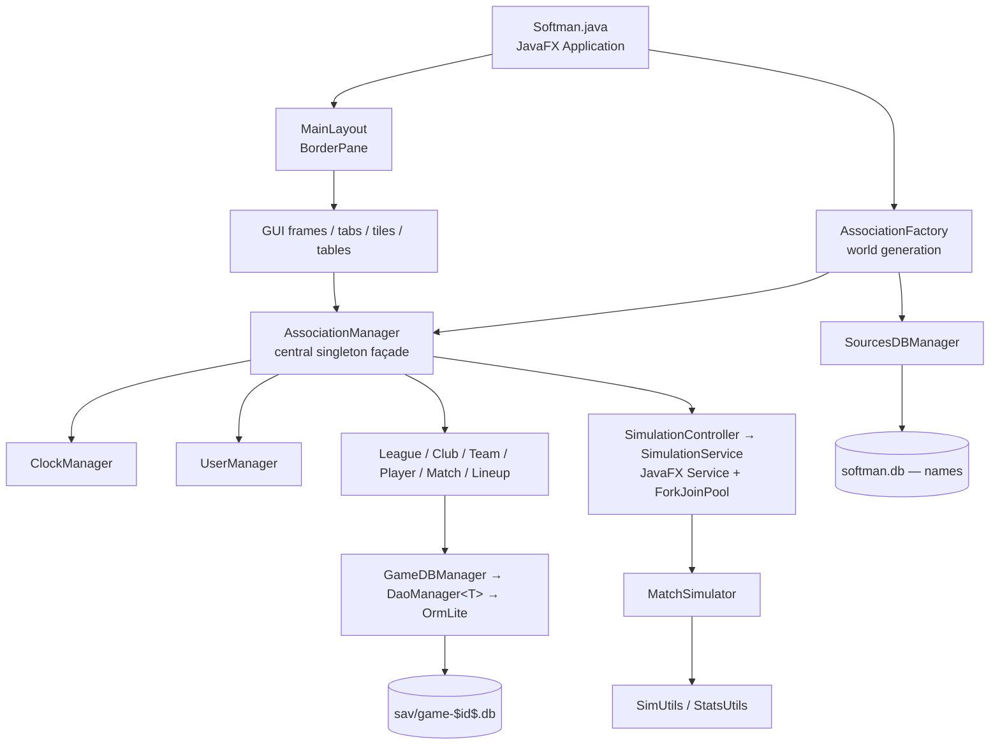

# SoftMan — Current State Summary

> Snapshot taken 2026-07-30. Purpose: map the existing codebase before resuming development.

Prompt (`Claude Opus 5` via `GitHub Copilot`):

> I am planning to ressurect this side project. It is a simulator of a softball team management currently written in Java 25 with JavaFX frontend. But before we move on, I need you to map the current state, so we know what we are working with. Go through the codebase, analyze the sources and create a new SUMMARY.md file that will contain the key observations about the architecture, file structure, implemented (and not implemented) features.

## 1. Project at a Glance

| Item | Value |
|---|---|
| Type | Desktop game — softball club/team management simulator |
| Language / Build | Java 25, Maven (`elrh:SoftMan:1.0-SNAPSHOT`, packaging `jar`) |
| UI | JavaFX 21.0.5 (programmatic, **no FXML files**) |
| Persistence | SQLite via OrmLite (lightweight ORM) |
| Source files | 76 main + 11 test = 87 `.java` files |
| Build status | ✅ `mvn clean test` → **BUILD SUCCESS**, 41 tests, 0 failures |
| Last commits | `19d87a5` / `e3eda92` (2026-02-02, Java 25 + dependency bump) — before that, dormant since 2024-07-19 |
| Branch | `master`, clean working tree |

### Dependency stack
`commons-lang3` · `sqlite-jdbc` · `ormlite-jdbc` · JavaFX (base/controls/fxml/graphics) · Lombok · SLF4J + slf4j-simple · BootstrapFX (CSS themes) · FontAwesomeFX (icons) · Medusa (gauges) · ControlsFX (GridView) · JUnit 5 + Hamcrest.

> ⚠️ README still says "Java 21" — stale after the Java 25 upgrade.

---

## 2. Architecture

Three-layer, singleton-heavy, with a manager façade in the middle.



### Package map

`softman-core/src/main/java/elrh/softman/` and `softman-desktop/src/main/java/elrh/softman/`

| Module | Package | Contents |
|---|---|---|
| desktop | `.` | `Softman` — JavaFX `Application` entry point, game setup/teardown |
| desktop | `gui` | `MainLayout` (BorderPane root) |
| desktop | `gui.frame` | `MenuFrame`, `FocusFrame`, `ContentFrame`, `ActionFrame` |
| desktop | `gui.tab` | `ClubTab`, `MatchTab`, `TeamTab`, `PlayerTab`, `LineupTab`, `TrainingTab`, `StandingsTab` |
| desktop | `gui.tile` | `ClubInfoTile`, `CalendarTile`, `ScheduleRowTile`, `MatchHeaderTile`, `BoxScoreTile`, `LineupTile`, `LineupRowTile`, `DefenseTile`, `PlayerInfoTile`, `PlayerAttributesTile` |
| desktop | `gui.table` | `LeagueStadingsTable`, `TeamPlayersTable` |
| desktop | `gui.sim` | `SimulationController`, `SimulationService` |
| desktop | `gui.utils` | `FormatUtils`, `GUIUtils`, `InfoUtils`, `ProgressIndicatorUtil` |
| core | `logic` | `AssociationManager`, `MatchSimulator`, `Result` (record-like OK/message wrapper) |
| core | `logic.core` | `League`, `Club`, `Team`, `Player`, `Match`, `Lineup` |
| core | `logic.core.stats` | `Standing`, `BoxScore` |
| core | `logic.managers` | `ClockManager`, `UserManager` |
| core | `logic.db` | `AbstractDBEntity`, `DaoManager<T>`, `GameDBManager`, `SourcesDBManager` |
| core | `logic.db.orm` | `ClubInfo`, `LeagueInfo`, `TeamInfo`, `lineup.LinuepInfo`, `player.*`, `match.*` |
| core | `logic.enums` | `PlayerPosition`, `PlayerLevel`, `PlayerGender`, `MatchStatus`, `StatsType`, `ActivityType` |
| core | `logic.interfaces` | `IFocusedClubListener`, `IFocusedTeamListener`, `ISimulationRunner` |
| core | `utils` | `Constants`, `ErrorUtils`, `SimUtils`, `StatsUtils`, `Utils` |
| core | `utils.factory` | `AssociationFactory`, `ClubFactory`, `TeamFactory`, `PlayerFactory` |

### Cross-cutting patterns
- **Singletons everywhere** — every manager, frame and tab exposes `getInstance()`. Convenient but makes testing awkward (see `AssociationManager.testMode` flag hack).
- **`Result` record** — `(boolean ok, String message)` returned from most mutating operations instead of exceptions; `ErrorUtils.handleException()` converts throwables into it.
- **Core/ORM split** — rich domain objects (`Player`, `Team`, …) wrap thin OrmLite entities (`PlayerInfo`, `TeamInfo`, …) that extend `AbstractDBEntity` (`getId()` + `persist()`).
- **Observer** — `UserManager` broadcasts focused-club/focused-team changes to registered tabs.
- **Lombok** — `@Data`, `@Getter/@Setter`, `@Slf4j` (log field renamed to `LOG` via `lombok.config`).
- **Two databases** — read-only `softman.db` (name pools, seeded from `names.sql`) and per-game `sav/game-$id$.db`.

---

## 3. Data Model

### Domain entities
- **Club** → owns many **Team**s (one per `PlayerLevel` + squad letter A/B/C), has money (`START_FUNDS = 100 000`), city, stadium, logo, colour.
- **Team** → 20 generated **PlayerInfo**s + a `defaultLineup`; belongs to a `LeagueInfo`.
- **Player** → `PlayerInfo` (name, gender, birth year, jersey #, portrait) + `PlayerAttributes` + per-match `PlayerStats` list + `seasonTotal`.
- **League** → teams, matches, `Standing` list; knows `leagueAbove` / `leagueBelow` for promotion/relegation.
- **Match** → `MatchInfo` + away/home `Lineup` + `BoxScore` + `MatchPlayByPlay` list.
- **Lineup** → 10 batting spots (`ArrayList<PlayerRecord>` per spot to model substitutions) + 8 substitutes; supports DP.

### Player attributes (16, all `1..100`, randomly rolled)
`battingPower`, `swingControl`, `pitchEvaluation`, `pitchingSpeed`, `ballControl`, `pitchVariety`, `fieldingReach`, `gloveControl`, `throwControl`, `strength`, `speed`, `endurance`, `recovery`, `talent`, `dedication`, `luck`, plus mutable `fatigue` (0–100).

Derived: `battingSkill`, `pitchingSkill`, `fieldingSkill`, `physicalSkill`, `total`.

### Persisted tables (11 DAOs registered in `GameDBManager`)
`softman_lineup_info`, `softman_match_info`, `softman_match_play_by_play`, `softman_match_result`, `softman_player_attributes`, `softman_player_record`, `softman_player_info`, `softman_player_stats`, `softman_club_info`, `softman_league_info`, `softman_team_info`.

---

## 4. Game Flow (as currently wired)

1. `Softman.setupGame()` → opens game DB with **hardcoded `gameId = "test"`** and **drops all tables**.
2. `AssociationFactory.populateAssociation()` → registers 16 hardcoded clubs, creates **one** league ("1st League Men"), forms 8 teams (20 random players each), schedules the season, forces the user onto `CLUB01`.
3. `AssociationManager.nextDay()` runs once during startup, then `MainLayout.setUp()` builds the UI.
4. User advances time with **Next day** / **Simulate until** in `ActionFrame` → `SimulationController` → `SimulationService` (JavaFX `Service` + `ForkJoinPool` parallel match simulation) → progress spinner.
5. Matches can also be watched play-by-play in `MatchTab` (S = simulate, P = single play, V = view).

### Season structure
- Season starts **1 April** (`League.LEAGUE_START`), one round per week.
- `getTotalRounds() = (teams - 1) * 4` → **28 rounds** for 8 teams (quadruple round-robin), 4 matches per round.
- Standings points = `wins * 2 + loses` (participation point per loss); tiebreak: points → games → run diff → RF → RA.

### Match simulation model (`MatchSimulator` + `SimUtils`)
- Loop: pitch outcome → play outcome → total bases / fielding outcome, driven by `qualityFactor = (batterSkill + rnd100) - (pitcherSkill + rnd100)`.
- Outcome tiers: `O_K` strikeout / `O_W` walk-or-HBP / `O_P` ball in play; then `P_H` hit / `P_F` fielded; then out vs. error.
- Mercy rules implemented (15/10/7 run margins by inning, walk-off after 7).
- Box score, hits, errors, and full batting/pitching/fielding stat lines are produced and saved via `StatsUtils.saveStats()`.
- Fatigue increases per `ActivityType` after a match and recovers each new day.

---

## 5. Feature Status

### ✅ Implemented and working
- World generation: 16 clubs, teams, procedurally-named players with portraits.
- Single-league season scheduling (28 rounds, weekly).
- Full match simulation with play-by-play text, box score, mercy rules, substitutions, DP rule.
- Batting / pitching / fielding statistics tracking, AVG / SLG / ERA / IP / FLD computation, per-match + season totals.
- League standings with promotion/relegation ordering helpers.
- Player fatigue gain and daily recovery.
- Lineup editor with validation (no duplicate players/positions), persisted per team.
- Defensive field visualisation, player attribute gauges, roster tables, daily calendar/schedule.
- Time control: next day, simulate-until-date, day/round browsing, spinner + background simulation.
- SQLite persistence layer with generic DAO wrapper.
- 41 unit tests covering managers, clock, club, league, lineup, match, player, team, user.

### ⚠️ Partially implemented
| Feature | State |
|---|---|
| Multi-league / multi-tier pyramid | Fully coded in `AssociationFactory` but **commented out** for start-up speed (`b011cfa`); only 1 league is live |
| Promotion / relegation | `getAdvancingTeams()` / `getRelegatedTeams()` / `recreateLeagues()` exist but the trigger is dead code (see §6) |
| Career statistics | `PlayerTab` shows season totals; multi-season aggregation is a TODO |
| Standings UI | `StandingsTab` still contains MOCK "Play league" / "Play round" buttons wired to broken `League.mockPlay*()` methods |
| `MatchTab` refresh | Works, but refreshes the whole schedule after every play (flagged TODO) |
| Play-by-play persistence | Only persisted when `visualMode` is on — simulated matches lose their PBP |

### ❌ Not implemented
- **New game / Load game / Save game / About** — all four `MenuFrame` items have empty handlers. There is effectively **no save-game system**: `gameId` is hardcoded to `"test"` and tables are dropped on every launch (`dropExisting = true`).
- **Training** — `TrainingTab` is a dummy 30-cell grid with empty listeners; no training logic, no attribute progression.
- **Statistics centre** tab — a `Label` placeholder.
- **Transfer market** tab — a `Label` placeholder; no contracts, wages, scouting or trading despite `money` existing on clubs.
- **Club selection** — user is force-assigned `CLUB01`.
- **Player aging / development / retirement** — age is computed, but nothing changes attributes over time.
- **Finance model** — `START_FUNDS` is set and displayed, never spent or earned.
- **Multi-season progression** — no year rollover in practice.
- **AI opponent management** — CPU teams never change lineups or rosters.
- **Playoffs / cups / international competition** — none.
- Fullscreen mode, custom window chrome, and exit confirmation are all commented out ("before going live").

---

## 6. Known Bugs, Dead Code and Risks

1. **Year rollover is unreachable** — `SimulationService` triggers `AssociationFactory.recreateLeagues()` on `LocalDate.of(2024, 1, 1)`, but `Constants.START_DATE` is `2025-03-31`. The whole new-season path can never run.
2. **`MatchResult` ORM entity is never instantiated or persisted** — dead table.
3. **`Match.getMatchFromDB()` is broken** — fabricates dummy lineups (`new Lineup(1, "a", "b", "c")`); comments admit lineups and PBP are not loadable.
4. **`League.mockPlayLeague/mockPlayRound/mockPreviewCurrentRound`** just append `"MOCK BROKEN AND HOPEFULLY DEAD"`; still reachable from `StandingsTab` buttons.
5. **`League.includeMatchIntoStandings()`** uses a `do/while` with an `index > 9` guard that can throw `IndexOutOfBounds` for leagues with >10 teams and never actually short-circuits correctly.
6. **Likely attribute bug** — `PlayerAttributes.getFieldingSkill()` averages `fieldingReach + gloveControl + pitchVariety`; `pitchVariety` looks like a copy/paste error (should probably be `throwControl`, which is instead used in `getPitchingSkill()`).
7. **Pervasive typo `LinuepInfo` / `getLinuepInfo()`** across ~15 files (also `dispalayedTeam`, "Manage yor player's").
8. **SQL string concatenation** in `SourcesDBManager.getRandomName()` — table/gender are internal constants today, but the pattern is injection-prone.
9. **`AssociationManager.testMode`** flag exists purely to bypass JavaFX during tests — smell that logic and UI are coupled.
10. **`@SuppressWarnings("unchecked")`** in `DaoManager.saveObject()` and `Lineup.positionPlayers` (generic array) — flagged TODOs.
11. **JavaFX runs unmodularised** — build logs `Unsupported JavaFX configuration: classes were loaded from 'unnamed module'`; there is no `module-info.java`.
12. **~67 open TODOs** across 28 files.

### TODO hot spots
| File | Approx. count | Theme |
|---|---|---|
| `MatchSimulator.java` | 9 | runner advancement, RBI on walks, assists, error severity, earned/unearned runs |
| `MenuFrame.java` | 5 | New/Load/Save/About + custom title bar |
| `AssociationFactory.java` | 5 | more leagues, club picking, test "B" team |
| `MatchTab.java` | 4 | refresh performance, substitute slot workaround |
| `Lineup.java` | 4 | validations, position getter, collection types |
| `League.java` | 3 | mock removal, team retrieval |
| `Match.java` | 4 | DB loading of lineups & PBP |
| `LineupTile.java` | 3 | data access efficiency |
| `StandingsTab.java` | 3 | remove mocks, dynamic league selection |
| `Softman.java` | 3 | exit confirmation, fullscreen, unified new-game |

---

## 7. Test Suite

| Test class | Tests | Uses DB |
|---|---|---|
| `AssociationManagerTest` | 11 | ✅ |
| `ClockManagerTest` | 5 | ❌ |
| `ClubTest` | 5 | ✅ |
| `LeagueTest` | 4 | ✅ |
| `LineupTest` | 7 | ❌ |
| `MatchTest` | 3 | ✅ |
| `PlayerTest` | 2 | ❌ |
| `TeamTest` | 2 | ✅ |
| `UserManagerTest` | 2 | ✅ |
| **Total** | **41** | all green |

DB tests use a real SQLite file (`softmanTest`) created/dropped around each class via `AbstractDBTest`.

**Not covered:** `MatchSimulator` and the entire `SimUtils` probability model, `StatsUtils` computations, stats persistence round-trip, all GUI classes, `SimulationService` concurrency, `AssociationFactory.recreateLeagues()`.

---

## 8. Resources

| Path | Contents |
|---|---|
| `src/main/resources/css/softman.css` | Custom theme layered on BootstrapFX |
| `src/main/resources/img/faces/` | 92 AI-generated portraits (`m00001`–`m00046`, `f00001`–`f00046`) |
| `src/main/resources/img/teams/` | 16 club logos |
| `src/main/resources/img/vecteezy/` | field, blank avatars |
| `src/main/resources/simplelogger.properties` | INFO level → `log/softman.log` |
| `names.sql` | ~2 500 first/last names seeding `softman.db` |
| `log/`, `sav/` | Runtime folders (must exist; `sav` is auto-created by `GameDBManager`) |

---

## 9. Running It

```powershell
mvn clean install     # compile + tests
mvn javafx:run        # launch
```

`softman.db` must exist in the working directory (built from `names.sql`); `sav/game-test.db` is recreated from scratch on every launch. `Esc` quits.

---

## 10. Suggested Priorities for the Revival

1. **Fix the dead year-rollover trigger** and get multi-season progression actually running — it unlocks promotion/relegation, which is already written.
2. **Implement save/load** — remove `dropExisting = true`, make `gameId` real, repair `Match.getMatchFromDB()`. Currently the game cannot persist a session at all.
3. **Re-enable the multi-league pyramid** (uncomment `AssociationFactory`), with lazy/async world generation so start-up stays fast.
4. **Delete the mock code** (`League.mockPlay*`, `StandingsTab` MOCK buttons, unused `MatchResult`) to reduce noise.
5. **Wire up `MenuFrame`** (New/Load/Save/About) — the UI shell already exists.
6. **Decide on the "management" pillars still missing**: training, finances, transfer market, player development. These are what turn a simulator into a manager game.
7. **Add tests for `MatchSimulator` / `SimUtils`** — the core game engine is currently untested.
8. **Housekeeping**: rename `Linuep*` → `Lineup*`, update README to Java 25, consider `module-info.java` for a clean JavaFX runtime.
